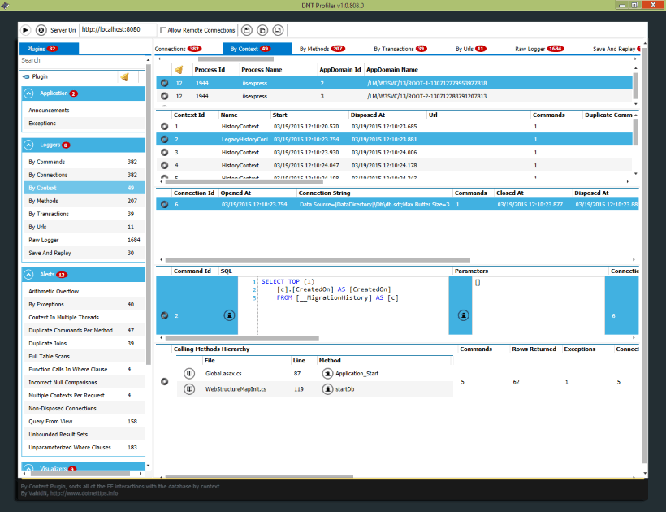

DNTProfiler
=======
DNTProfiler is an EntityFramework 6.x and NHibernate 4.x profiler.


DNTProfiler for EF 6.x
-----------------

Install via NuGet
-----------------
To install DNTProfiler for EF 6.x, run the following command in the Package Manager Console:

```
PM> Install-Package DNTProfiler.EntityFramework.Core
```

You can also view the [package page](http://www.nuget.org/packages/DNTProfiler.EntityFramework.Core/) on NuGet.

## Usage
* To start using DNTProfiler.EntityFramework.Core package, add the following lines to app.config/web.config file:
```xml
<configuration>
  <entityFramework>
    <interceptors>
      <interceptor type="DNTProfiler.EntityFramework.Core.DatabaseLogger, DNTProfiler.EntityFramework.Core">
        <parameters>
          <parameter value="http://localhost:8080" />
          <parameter value="|DataDirectory|\ErrorsLog.Log" />
        </parameters>
      </interceptor>
    </interceptors>
  </entityFramework>
</configuration>
```
* To disable the DNTProfiler.EntityFramework.Core, just remove or comment out the above settings.
* To view its real-time collected information and reports, you need to download the DNTProfiler application too.
You can download it [from here](https://github.com/VahidN/DNTProfiler/releases).


DNTProfiler for NHibernate 4.x
----------------

Install via NuGet
-----------------
To install DNTProfiler for NH 4.x, run the following command in the Package Manager Console:

```
PM> Install-Package DNTProfiler.NHibernate.Core
```

You can also view the [package page](http://www.nuget.org/packages/DNTProfiler.NHibernate.Core/) on NuGet.

## Usage
* To start using DNTProfiler.NHibernate.Core package, add the following lines to app.config/web.config file:
```xml
<appSettings>
    <add key="DNTProfilerServerUri" value="http://localhost:8080" />
    <add key="DNTProfilerLogFilePath" value="|DataDirectory|\ErrorsLog.Log" />
</appSettings>
```
And then to configure the NHibernate to use the provided driver:
* FluentNHibernate:
```csharp
Fluently.Configure().Database(
  MsSqlConfiguration.MsSql2008.ConnectionString(ConnectionString).Driver<ProfiledSql2008ClientDriver>()
);
```
* Loquacious style configuration:
```csharp
cfg.SetProperty(NHibernate.Cfg.Environment.ConnectionDriver,
                typeof(ProfiledSql2008ClientDriver).AssemblyQualifiedName);
```
* XML style configuration:
```xml
<property name="connection.driver_class">
   DNTProfiler.NHibernate.Core.Drivers.ProfiledSql2008ClientDriver,DNTProfiler.NHibernate.Core
</property>
```
* To disable the DNTProfiler.NHibernate.Core, just remove or comment out the above settings.
* To view its real-time collected information and reports, you need to download the DNTProfiler application too.
You can download it [from here](https://github.com/VahidN/DNTProfiler/releases).


**Screenshots:**


